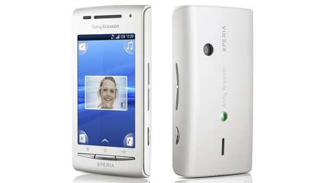

# Sony Ericsson Xperia X8 (Kernels)

## Mirrors
* https://disk.yandex.ru/d/mohmGC3iCYZjWw
* https://drive.google.com/file/d/1TFWW_LQrl4IxPLdZJmTBRi5r-ieAfKAc/view?usp=sharing
* https://www.mediafire.com/file/zjrdtcp0jml3r84/Sony-Ericsson-X8-Kernels-1.0.0.zip/file
* https://4pda.to/forum/index.php?showtopic=193410&view=findpost&p=129930972

## nAa ([XDA Link](https://xdaforums.com/t/kernel-2-6-32-61-naa-jb-06-6-7-2013-new-wifi-usb-unified-kernel-cwm-recovery.2136211/))
* E15_2.6.32.60-nAa-05
    * Checksum: 798f89f2f1de633dbd50d8921094f59f
    * Date: 2013-03-16
* E15_2.6.32.61-nAa-06
    * Checksum: bf6315bc5eeacdb8762af521754ea9ca
    * Date: 2013-07-06

## nAa-14 ([XDA Link](https://xdaforums.com/t/kernel-2-6-29-6-naa-14-23-8-12-custom-gingerbread-kernel-cwm-recovery.1350484/))
* E15_nAa-14_2.6.29.6-nAa-14
    * Checksum: 0c180a2e577847f1f6b92c283e51f03c
    * Date: 2012-08-23

## nAa-ics-04 ([XDA Link](https://xdaforums.com/t/kernel-2-6-29-6-naa-ics-04-5-7-12-custom-ics-kernel-cwm-recovery.1576002/))
* E15_nAa-ics-04_2.6.29.6-nAa-ics-04
    * Checksum: 01e5d3a61c28a36d3b3d86d522b3c5a6
    * Date: 2012-07-05

## XPerience ([XDA Link](https://xdaforums.com/t/kernel-gb-ics-jb-kk-2-6-32-63-xperience-kk06-01-08-2014.2700749/))
* 2.6.32.63-XPerience-KK06
    * Checksum: 22569e83e77f977510e7db18a5f80034
    * Date: 2014-08-01